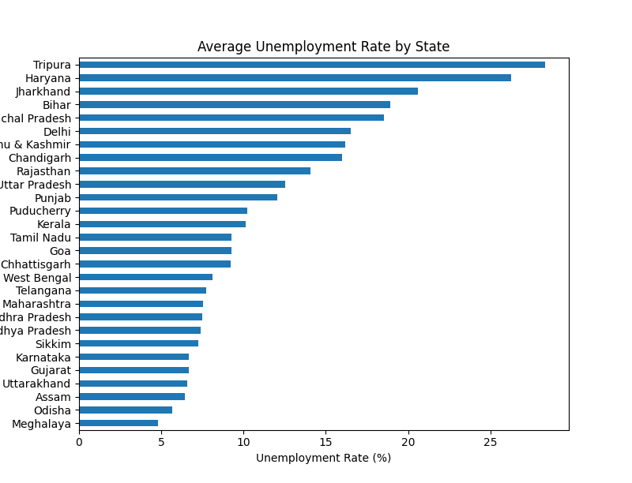

<<<<<<< HEAD
# Task 2: Unemployment Analysis with Python

## 📌 Objective
The objective of this project is to analyze unemployment rate data in India using Python.
The analysis focuses on understanding unemployment trends, the impact of Covid-19,
and differences across regions and areas (Rural vs Urban).

---

## 📂 Datasets Used
1. *Unemployment_Rate_upto_11_2020.csv*  
   - Contains unemployment data during the Covid-19 period in 2020.

2. *Unemployment in India.csv*  
   - Contains overall unemployment data across different states and time periods.

---

## 🛠️ Tools & Technologies
- Python  
- Pandas  
- Matplotlib  
- Seaborn  
- VS Code  

---

## 🔍 Steps Performed
- Imported and explored the datasets  
- Cleaned and preprocessed the data  
- Converted date columns into datetime format  
- Visualized unemployment trends over time  
- Analyzed the impact of Covid-19 on unemployment  
- Compared Rural vs Urban unemployment rates  
- Performed state-wise unemployment analysis  

---

## 📊 Key Visualizations
- Unemployment rate trend over time  
- Covid-19 impact on unemployment (2020)  
- Rural vs Urban unemployment comparison  
- State-wise average unemployment rates  

---

## 💡 Key Insights
- Unemployment increased sharply after March 2020 due to Covid-19 lockdowns  
- Urban unemployment was higher than rural unemployment  
- Significant variation in unemployment rates across states  
- Employment conditions gradually improved after lockdown relaxation  

---

## ✅ Conclusion
This project demonstrates how data analysis and visualization techniques
can be used to study economic indicators such as unemployment.
The insights obtained can help policymakers and organizations
understand employment trends and plan effective strategies.

---

## ▶️ How to Run the Project
1. Install required libraries:
   ```bash
   python -m pip install pandas matplotlib seaborn
Run the Python file:
Copy code
Bash
python task2_unemployment.py
📌 Project Structure
Copy code

Task2-Unemployment-Analysis
│
├── task2_unemployment.py
├── Unemployment_Rate_upto_11_2020.csv
├── Unemployment in India.csv
└── README.md
👤 Author
Shamal Saste
=======
**# Task 2: Unemployment Analysis with Python**

**## Objective**
The objective of this project is to analyze unemployment rate data in India using Python.
The analysis focuses on understanding unemployment trends, the impact of Covid-19,
differences across regions and areas (Rural vs Urban) and the difference of statewise unemployment.

---

**## Datasets Used**
1. *Unemployment_Rate_upto_11_2020.csv*  
   - Contains unemployment data during the Covid-19 period in 2020.

2. *Unemployment in India.csv*  
   - Contains overall unemployment data across different states and time periods.

---

**## Tools & Technologies**
- Python  
- Pandas  
- Matplotlib  
- Seaborn  
- VS Code  

---

**## Steps Performed**
- Imported and explored the datasets  
- Cleaned and preprocessed the data  
- Converted date columns into datetime format  
- Visualized unemployment trends over time  
- Analyzed the impact of Covid-19 on unemployment  
- Compared Rural vs Urban unemployment rates  
- Performed state-wise unemployment analysis  

---

**## Key Visualizations**
- Unemployment rate trend over time  
- Covid-19 impact on unemployment (2020)  
- Rural vs Urban unemployment comparison  
- State-wise average unemployment rates  

---

**## Key Insights**
- Unemployment increased sharply after March 2020 due to Covid-19 lockdowns  
- Urban unemployment was higher than rural unemployment  
- Significant variation in unemployment rates across states  
- Employment conditions gradually improved after lockdown relaxation  

---

**##  Output Visualizations**

### Unemployment rate in 2020
.png)

### Covid-19 Impact on Unemployment


### Rural vs Urban Unemployment


### State-wise Unemployment Rate


### Unemployment rate in india(2020)
.png)

---

**## Conclusion**
This project demonstrates how data analysis and visualization techniques
can be used to study economic indicators such as unemployment.
The insights obtained can help policymakers and organizations
understand employment trends and plan effective strategies.

---

**## How to Run the Project**
1. Install required libraries:
   ```bash
   python -m pip install pandas matplotlib seaborn
Run the Python file:
python task2_unemployment.py


**👤 Author**
Name: Shamal Saste
Internship Role: Data Science Intern
Organization: CodeAlpha


>>>>>>> 443b7ee41450bf5775151e582a2ec3269b164f77
